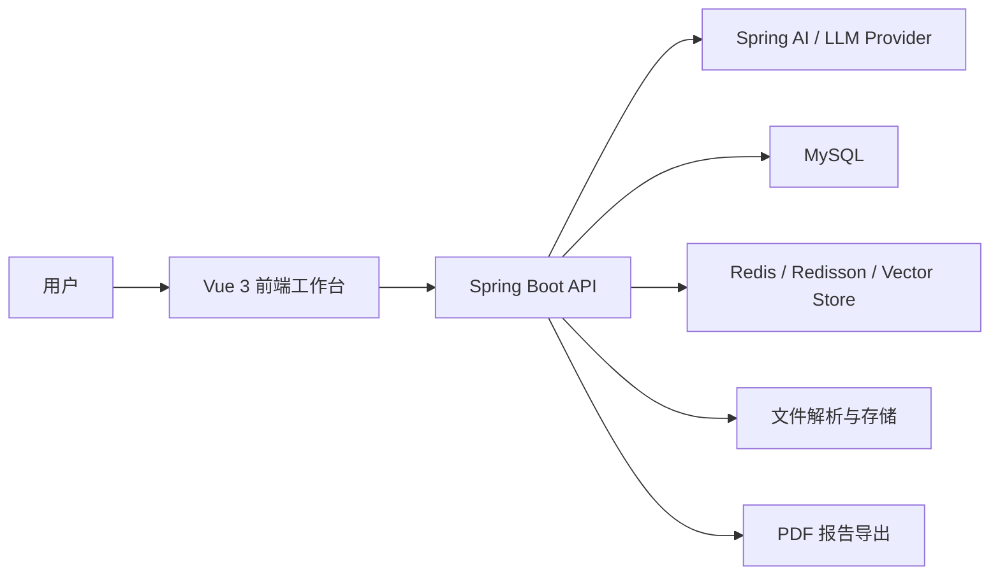

# AI Interview Copilot

> 一个围绕「简历分析 + 模拟面试 + 知识库问答」打造的 AI 面试助手项目，提供完整的前后端工作台体验。

## 项目简介

AI Interview Copilot 面向求职准备场景，尝试把简历优化、题目练习、知识沉淀和面试复盘放进同一条体验链路中。

项目采用 `Spring Boot + Spring AI + Vue 3` 的前后端分离架构，围绕三个核心场景展开：

- 上传简历，自动完成解析、评分、总结与优化建议生成
- 发起模拟面试，进行多轮问答、阶段评估与报告导出
- 上传知识文档，完成向量化检索与基于知识库的 RAG 问答

它更像一个完整的 AI 面试工作台，而不只是单点功能 Demo。

## 核心亮点

- **简历分析闭环**：支持简历上传、内容解析、AI 评分、结果回看与 PDF 导出，适合做求职前的快速诊断。
- **模拟面试工作流**：从创建会话、生成题目、逐题作答，到评估报告与历史记录管理，流程完整。
- **知识库问答能力**：支持文档上传、分类管理、向量化检索、SSE 流式返回与独立 RAG 聊天会话。
- **统一产品体验**：前端以单工作台形态组织“简历 / 面试 / 知识库”三条能力线，交互路径清晰。
- **工程化后端设计**：集成限流、异步任务、Redis 缓存、结构化输出调用、文件解析与 PDF 导出等基础能力。

## 功能全景

### 1. 简历分析

- 上传 PDF、Word、TXT 等格式的简历文件
- 自动识别重复简历，避免重复分析
- 生成简历总结、AI 评分与优化建议
- 支持查看历史分析结果和导出 PDF 报告
- 可以从简历详情直接跳转进入模拟面试

### 2. 模拟面试

- 创建面试会话并配置面试方向、题目数量、LLM Provider
- 支持逐题答题、暂存答案、提前交卷
- 自动生成面试结果、总结与详情页复盘内容
- 提供面试记录列表与 PDF 报告导出能力

### 3. 知识库与 RAG 问答

- 上传知识文档并进行分类管理
- 支持知识库统计、搜索、下载和删除
- 进行向量化处理后，可基于知识库发起智能问答
- 提供独立的 RAG Chat 会话，支持流式输出与会话管理

## 技术栈

| 分层 | 技术选型 |
| --- | --- |
| 后端 | Spring Boot 3.4、Java 17、Spring AI、MyBatis、Redisson |
| AI 能力 | OpenAI Compatible API、Structured Output、RAG 检索问答 |
| 数据与缓存 | MySQL、Redis、Redis Vector Store |
| 文件与导出 | Apache Tika、iText PDF |
| 前端 | Vue 3、TypeScript、Vite、Vue Router、Tailwind CSS 4 |
| 工程能力 | 限流注解/AOP、异步流处理、统一响应包装、SSE 流式接口 |

## 系统架构



### 后端模块

- `resume`：简历上传、解析、评分、历史记录
- `interview`：模拟面试会话、题目生成、答题评估、报告导出
- `knowledgebase`：文档上传、向量检索、RAG 问答、聊天会话
- `common`：限流、AI 调用包装、统一结果、异常处理、异步基础设施
- `infrastructure`：文件处理、PDF 导出、Redis 服务、Mapper 支撑

### 前端工作台

- 简历上传页、简历库、简历详情页
- 模拟面试入口、面试过程页、面试记录页、面试详情页
- 知识库上传页、知识库管理页、知识库问答页
- 左侧导航统一串联所有核心能力，具备较强的产品展示感

## 前端体验

这个项目的前端不是传统后台管理页式样，而是更偏“AI 助手工作台”的组织方式：

- 首页路径直接导向真实任务流，而不是空壳仪表盘
- 通过侧边导航把简历、面试、知识库三条链路串联起来
- 详情页保留分析状态、处理中反馈、空态提示和操作闭环
- RAG 问答页支持流式回答，能够更直观体现 AI 交互体验

## 后端能力

后端除了业务 API 之外，还具备比较完整的工程基础：

- `@RateLimit` 注解 + AOP 限流能力
- Redis 相关缓存与向量检索支持
- 结构化输出调用封装，方便对接多种 LLM Provider
- 文件上传、内容解析、文本清洗、PDF 导出等基础设施
- 统一 `Result<T>` 响应格式与全局异常处理机制

## 项目结构

```text
.
├── app
│   └── src
│       ├── main
│       │   ├── java/interview/guide
│       │   │   ├── common
│       │   │   ├── infrastructure
│       │   │   └── modules
│       │   └── resources
│       └── test
├── frontend
│   ├── src
│   │   ├── api
│   │   ├── components
│   │   ├── router
│   │   ├── types
│   │   ├── utils
│   │   └── views
│   └── public
├── pom.xml
└── README.md
```

## 快速开始

### 后端

```bash
mvn spring-boot:run
```

### 前端

```bash
cd frontend
npm install
npm run dev
```

### 建议提前准备的环境变量

- `MYSQL_URL`
- `MYSQL_USERNAME`
- `MYSQL_PASSWORD`
- `REDIS_HOST`
- `REDIS_PORT`
- `DASHSCOPE_API_KEY`

## 项目定位总结

如果你希望在 GitHub 上展示一个更接近真实产品形态的 AI 项目，而不是只展示单条模型调用链路，那么这个项目覆盖了：

- 面向求职场景的明确业务主题
- 完整的前后端分离实现
- 可视化工作台体验
- LLM、RAG、文件处理、导出能力的组合落地

它适合作为 AI 应用项目集中的代表性作品之一。
